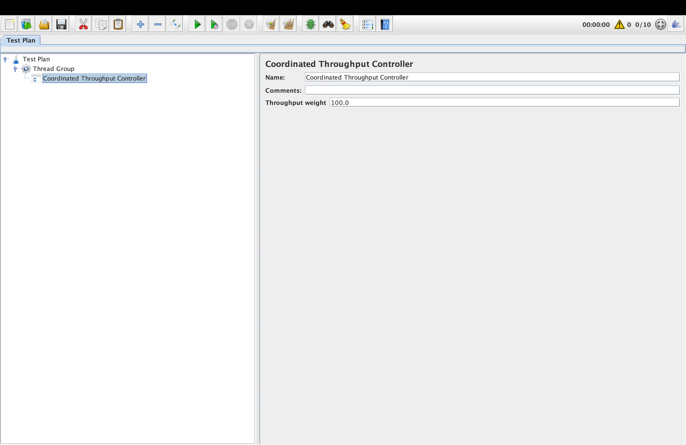
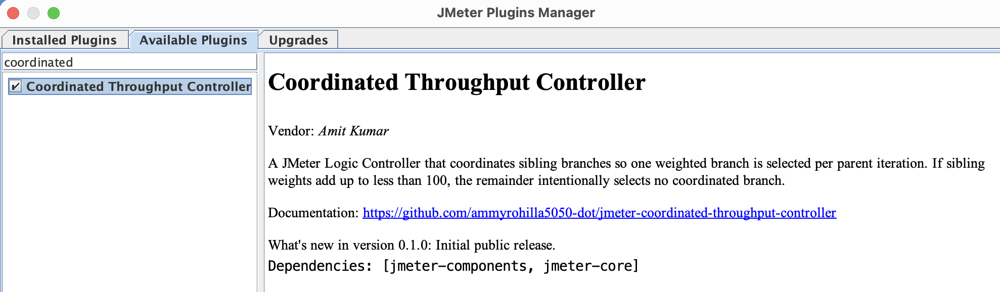

# Coordinated Throughput Controller

[](https://plugins.jmeter.ai/plugin/coordinated-throughput-controller/)

Coordinated Throughput Controller is an external Apache JMeter logic controller
that coordinates sibling controllers under the same parent. During each
parent iteration, sibling Coordinated Throughput Controllers make one shared
selection decision, so only one coordinated controller runs. If the configured
weights add up to less than 100, some parent iterations intentionally run none
of the coordinated controllers.


## Why This Exists

JMeter's standard Throughput Controller evaluates each sibling independently.
If two sibling controllers are both configured at 50%, both can run in the same
parent iteration. This plugin is for test plans that need weighted
controller selection where sibling controllers are mutually exclusive and only one controller run at any given iteration.


## Weight Behavior

| Use case | Example setup | What the controller does | Expected result |
| --- | --- | --- | --- |
| Total weight equals `100` | `Controller A=40`, `Controller B=60` | The controller treats the values as percentage shares. The full selection pool is consumed by real controllers, so every parent iteration selects exactly one coordinated controller. There is no empty or skipped remainder. | Over 100 parent iterations, Controller A runs about 40 times and Controller B runs about 60 times. In each parent iteration, either Controller A or Controller B runs, never both. |
| Total weight is less than `100` | `Controller A=20`, `Controller B=30`, total is `50` | The controller treats the missing portion as an intentional "no controller selected" share. Internally, the selection pool is `Controller A=20`, `Controller B=30`, and `no controller=50`. When `no controller` is selected, all sibling coordinated controllers are skipped for that parent iteration. | Over 100 parent iterations, Controller A runs about 20 times, Controller B runs about 30 times, and no coordinated controller runs about 50 times. This is useful when only part of the total traffic should enter these coordinated flows. |
| Total weight is greater than `100` | `Controller A=60`, `Controller B=90`, total is `150` | There is no remaining "no controller selected" share because the total already exceeds 100. The controller treats the values as relative weights. So `Controller A=60`, `Controller B=90` behaves like a 60:90 ratio. | Controller A receives about `60 / 150 = 40%` of selections and Controller B receives about `90 / 150 = 60%`. Over 100 parent iterations, Controller A runs about 40 times and Controller B runs about 60 times. |

In all cases, the selected controller runs its child samplers/controllers normally.
Non-selected sibling controllers return no sampler for that parent iteration.

## Sample JMX

A small flight-booking example is available here:
[flight-booking-coordinated-throughput-controller.jmx](examples/flight-booking-coordinated-throughput-controller.jmx).

It contains one thread group showing the standard Throughput Controller behavior
and another thread group showing the same flow fixed with Coordinated Throughput
Controller.

## Requirements

| Requirement | Value |
| --- | --- |
| Requires Java Version | Java 8 or later |
| JMeter Version | Apache JMeter 5.5 or later. Checked with JMeter 5.5, 5.6, 5.6.1, 5.6.2, and 5.6.3. |
| External Dependencies | Fully standalone plugin JAR. No additional external dependency JARs are required beyond Apache JMeter. |

## Not Supported Cases

Do not use Coordinated Throughput Controller directly under these parent
controllers when you need exact coordinated distribution:

1. Loop Controller as the direct parent of Coordinated Throughput Controllers.
2. Random Controller as the direct parent.
3. Once Only Controller as the direct parent.

## Screenshot



## Install
1. Search `Coordinated Throughput Controller` in the JMeter Plugins Manager
   and click `Apply changes and Restart JMeter`. If Plugins Manager is not
   available under Options, first download the Plugins Manager jar and place it
   in the `<JMETER_HOME>/lib/ext/` folder.



OR

1. Download [jmeter-coordinated-throughput-controller-0.1.1.jar](https://github.com/ammyrohilla5050-dot/jmeter-coordinated-throughput-controller/releases/download/v0.1.1/jmeter-coordinated-throughput-controller-0.1.1.jar).
2. Copy it to:

   ```text
   <JMETER_HOME>/lib/ext/
   ```

3. Restart JMeter.
4. Add it from the Logic Controller menu as `Coordinated Throughput Controller`.

## Support and Bug Reports

Please report bugs in GitHub Issues for this repository.

When reporting a bug, include:

- Coordinated Throughput Controller version
- Apache JMeter version
- Java version
- Operating system
- A small reproducible `.jmx` test plan, if possible
- Controller tree structure
- Configured controller weights
- Expected result and actual result
- Relevant `jmeter.log` errors or stack traces
- Whether the Coordinated Throughput Controller is placed under special parent
  controllers such as Loop Controller, Random Controller, or Once Only
  Controller

For general JMeter Plugins questions, you can also use the JMeter Plugins
community forum.

## License

Apache License, Version 2.0.
